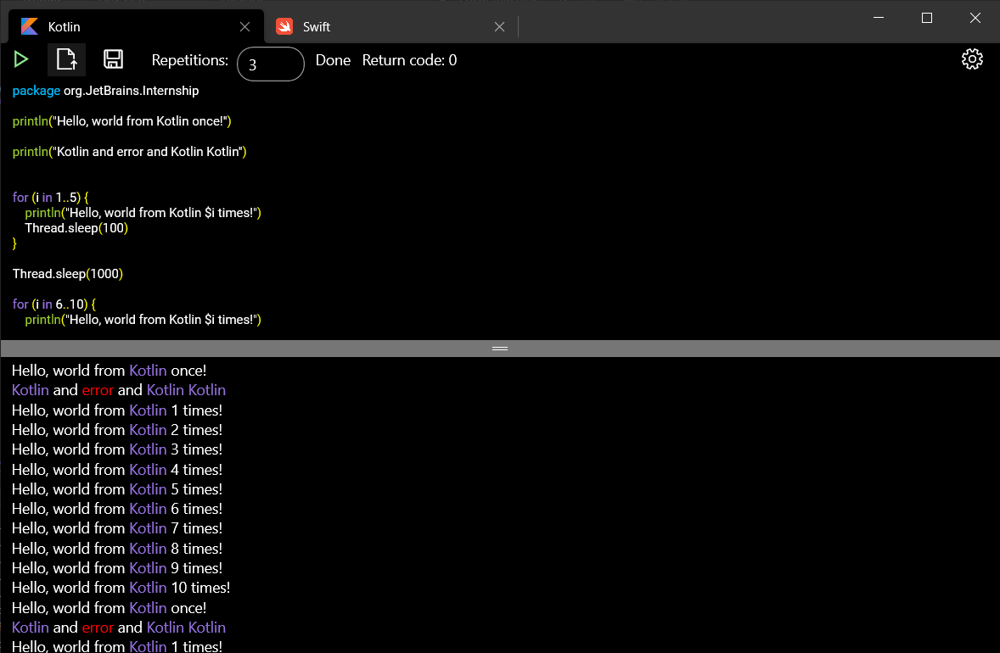
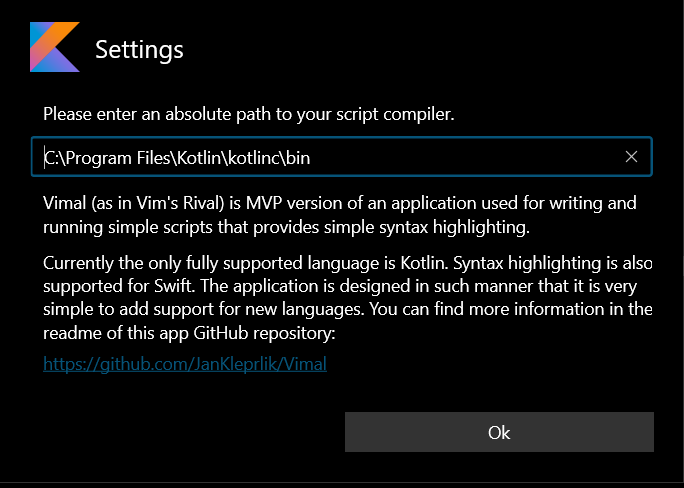
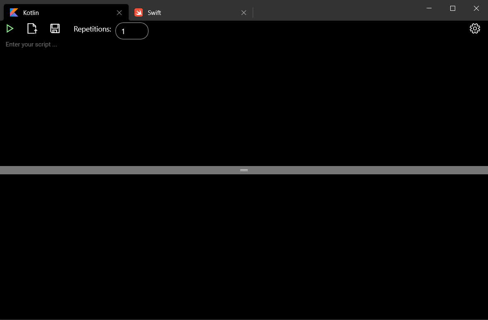

# Vimal
Vimal is MVP UWP application for writing scripts, executing them and providing syntax simple highlighting for specified languages.
> Vimal stands for Vim's Rival

## Content
- [Installation](#instalation)
- [How To Use](#how-to-use)
- [What has been done](#what-has-been-done)
- [What could be improved](#what-could-be-improved)

## Instalation
> App is supported only on devices with Windows of version at least 10.0.17763.0

Installation package can be downloaded from [here](https://uloz.to/tam/32374d05-410b-41bc-b244-21a8ea11382c).

If you want to build the project yourself in VisualStudio make sure you have **Universal Windows Platform development** installed. More info [here](https://docs.microsoft.com/en-us/windows/apps/windows-app-sdk/set-up-your-development-environment?tabs=vs-2022-17-1-a%2Cvs-2022-17-1-b).

All other packages and dependencies should be already setup for you.

## How To Use

Currently the only fully supported language is *Kotlin*. On startup and later in settings you can provide path to Kotlin compiler. Please provide an absolute path to the compiler otherwise the script will not be executed. The folder should contain `kotlinc.bat` file and `kotlinc` file.

> Example path could be *C:\Program Files\JetBrains\Kotlin\bin*

The GUI is pretty straight forward. At the top we have two tabs. First is for *Kotlin* development and the other for *Swift* development.
> Note that only only *Kotlin* development is fully supported right now.
The tab contains few basic controls for running the script, uploading script from file and saving current script into file. At the right we can see settings button where we can modify the path to the script compiler.

Below there is pane to write your script into. Below that there is an output window.

## What has been done
List of required features: 
- [x] Should have an editor pane and an output pane.
- [x] Write the script to a file and run it using `/usr/bin/env swift foo.swift`, or `kotlinc -script foo.kts` respectively.
- [x] Assume the script might run for a long time.
- [x] Show live output of the script as it executes.
- [x] Show errors from the execution/if the script couldn’t be interpreted.
- [x] Show an indication whether the script is currently running.
- [x] Show an indication whether the exit code of the last run was non-zero.

List of optional features:
- [x] Highlight language keywords in a color different from the rest of the code. You may assume that keywords are not valid in other contexts, e.g. as enum member names. You may restrict yourself to 10 keywords, if more could be added easily.
- [ ] Make location descriptions of errors (e.g. “script:2:1: error: cannot find 'foo' in scope”) clickable, so users can navigate to the exact cursor positions in code.
- [x] Add a mechanism to run the script multiple times. Show a progress bar as well as an estimate of the time remaining. The estimate should be based on the time elapsed for already finished runs of the batch. More recent runs should be weighted more than older ones.

### Highlighting
I have provided the application with some of the keywords for both *Kotlin* and *Swift*. Based on the tab you are writing the script in you will get different keywords highlighted. 

> Try on `fun` and `Func` for Kotlin and Swift respectively.

It is fairly easy to add support for more languages. As an example I have created a `Output` language which highlights words *Kotlin* and *error* in the output pane.

### Clickable errors
Unfortunately I did not have enough time to implement this feature. However, the implementation should be straight forward.

### Timer
I have decided not to add a progress bar for the script execution as it seemed very distracting and did not fit to the UI in my opinion. I have added a timer that estimates the time left before the script runs are finished.

List of features I have added because I thought they should be included:
- [x] Upload script from file.
- [x] Save script into file.
- [x] Browser-like keyboard control of tabs (`CTRL + W`, `CTRL + T`, `CTRL + 1-9`)

List of features that are implemented but are disabled because I was not able to throughtfully test them:
- [ ] Light and Dark mode support. 
- [ ] Multiple language support.
- [ ] Adding new tabs for different scripts.
> Last feature can actually be accessed using keyboard shortcuts.
## What could be improved
Some of the UI elements could be defitely improved. For example highlighting text in the script pane is not ideal. 